# Instalaciones previas
## Contenido
1. [Descarga](#1-descarga)
2. [Instalación](#2-instalación)
3. [Arrancando Workbench](#3-arrancando-workbench)

## MySQL y Workbench

MySQL Workbench es una herramienta de administración de bases de datos que se usa para gestionar bases de datos MySQL.

Necesitaremos instalar el servicio de MySQL para que nos levante el servidor local donde instalaremos por el momento las bases de datos.

Workbench nos permite diseñar esquemas, crear y modificar tablas, además de ejecutar consultas SQL y administrar el rendimiento de bases de datos entre otras funciones.

### 1. Descarga

Abre tu navegador web y ve al enlace de descarga de MySQL Workbench: https://dev.mysql.com/downloads/installer/

En la ventana que nos aparece selecionamos la segunda opción:

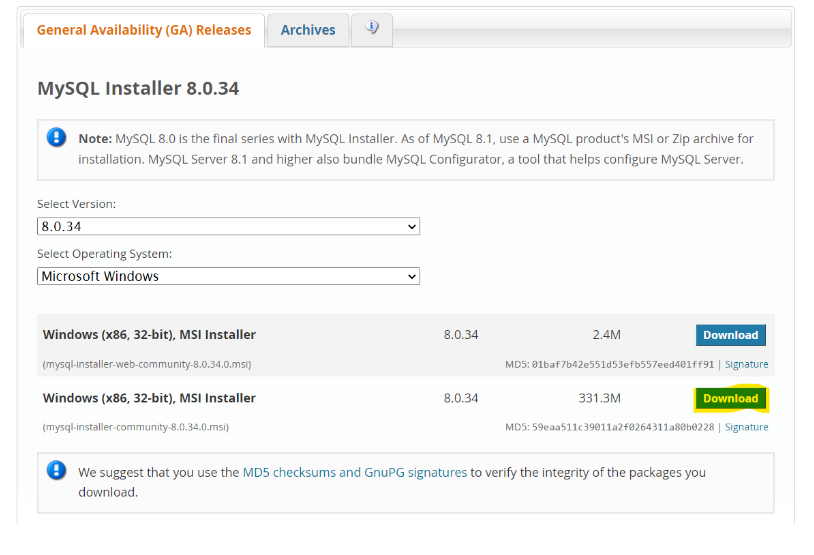

Haz clic en el enlace de descarga correspondiente para empezar a descargar el instalador.

En la nueva ventana, clicka en **“No gracias, sólo comenzar la descarga”**

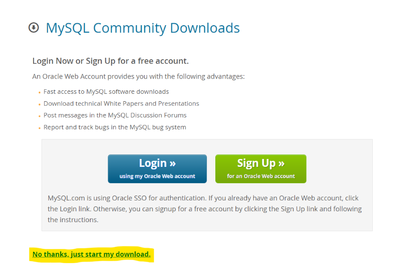

### 2. Instalación

Una vez que se haya descargado el archivo de instalación, haz doble clic en él para ejecutarlo.

El asistente de instalación se abrirá, seleccionamos tipo de instalación **“Custom”** y damos a “Siguiente”.

Nos aparecerá una ventana como esta:
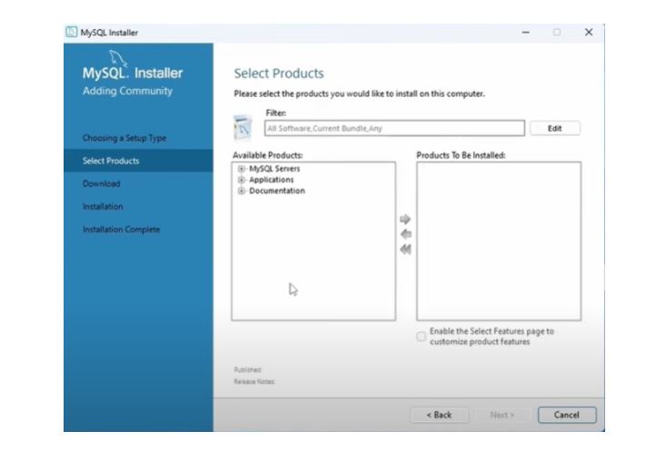

Dentro de MYSQL Servers, desplegamos todo y seleccionamos MySQL Server 8.0.34 - x64 ( los números de la versión pueden cambiar en caso de que haya una nueva versión disponible así como x64 en función del equipo que tengáis).

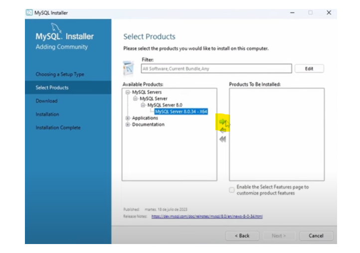

Pinchamos en la flecha verde, y nos pasará el elemento seleccionado al listado de la derecha, que son los elementos que realmente se instalarán.

Dentro de Aplicaciones seleccionaremos 2 elementos: MySQL Workbench 8.0.34 y MySQL Shell 8.0.34, los añadimos al listado de elementos a instalar con la flecha.
En el apartado de Documentación: seleccionamos: MySQL Documentation 8.0.34 (la documentación nunca nos va a sobrar) y Sample and Examples 8.0.34 (bases de datos para empezar a trastear).

Nuestra ventana debería quedar algo así:

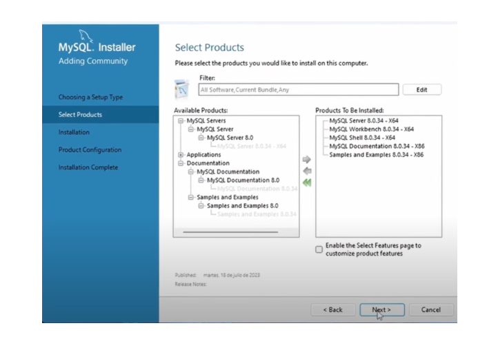

Damos a next, para empezar la instalación de los elementos seleccionados.

El siguiente paso es de Installation, nos mostrará de nuevo lo que vamos a instalar, simplemente clickamos en “Execute”.

Una vez termine de hacer todas las instalaciones y descargar de ficheros, nuestra venta debería verse así:

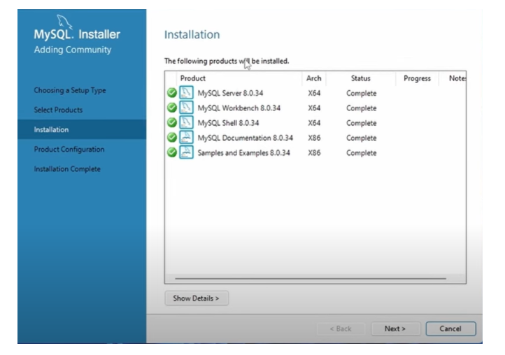

Pinchamos en “Next”. En el siguiente paso, simplemente nos indicará que los productos están listos para configurar, damos a “Next” de nuevo.

En el siguiente paso tenemos que seleccionar tipo de configuración > Development Computer (debería venir por defecto, sino la seleccionamos):

El resto de opciones deberían quedar por defecto así:

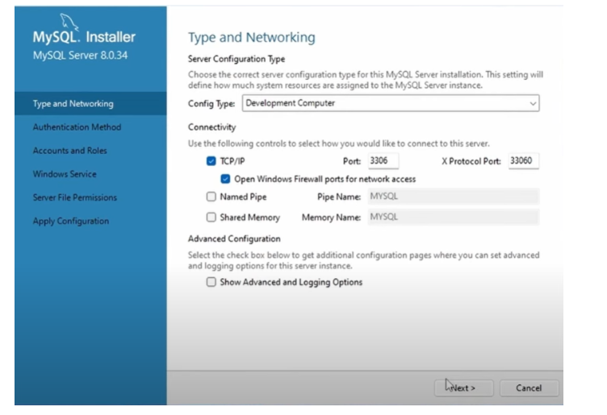

Damos a “Next”. El siguiente paso nos avisa del método de encriptación de la contraseña, dejamos seleccionado el que indica “Recommended” (SHA256-bassed) y “Next”.

El siguiente paso es darle una contraseña a nuestro usuario **root**, esta es la contraseña que usaremos para conectarnos. Por favor, `no perdáis/olvidéis` esta contraseña que recuperarla luego es un dolor.

Tecleamos la contraseña en los dos casilleros y “Next”:

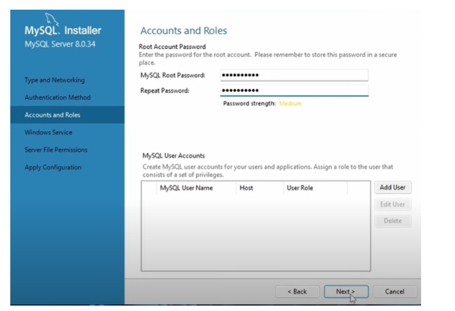

Nos pedirá cómo queremos que se llame nuestro servicio y con que cuenta de usuario queremos que se ejecute, dejamos todo por defecto y “Next”:

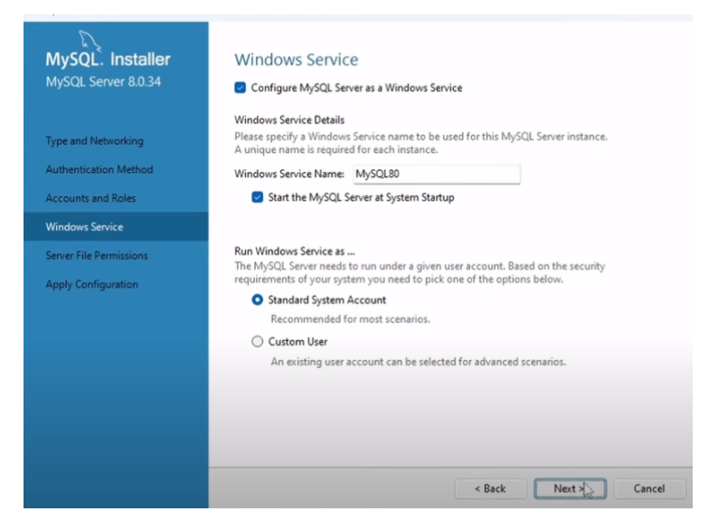

En la siguiente pantalla, nos dirá qué permisos queremos darle a los servicios. Le damos a la opción que indica algo así como “grant full access” y “Next”. El siguiente paso es para aplicar la configuración que hemos configurado, le decimos “Execute” y esperamos a que termine el proceso.

Si todo ha ido bien deberíamos ver una pantalla como esta:

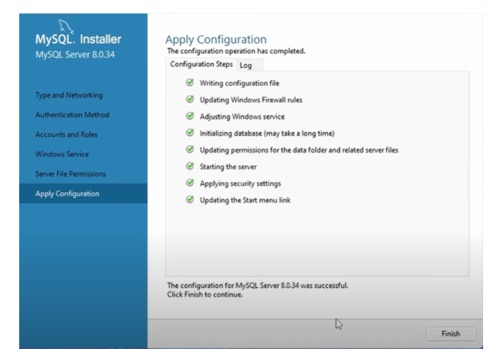

Ahora intentará conectarse a MySQL, nos pedirá la contraseña que hemos puesto antes para nuestro usuario root, pinchamos en “Check” para comprobar que la conexión está funcionando, si todo sale bien debería salirnos algo como esto:

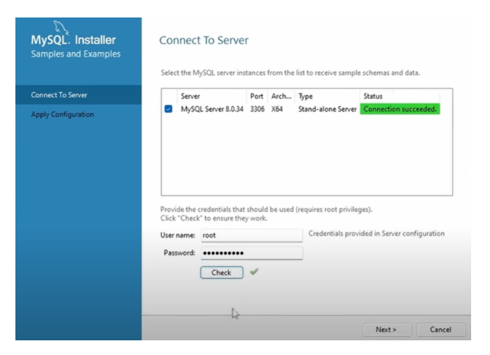

Damos en “Next” y en el siguiente paso, “Execute”, para que instale las bases de datos de ejemplo que hemos añadido a nuestra instalación personalizada.

En el último paso, nos dirá si queremos iniciar Workbench y la Shell de Workbench, seleccionamos sólo “Start MySQL Workbench after setup” y “Finish”:

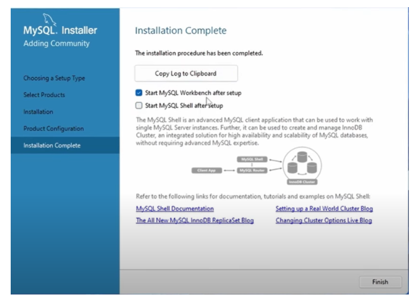

Introducimos la contraseña y “Next”.

### 3. Arrancando Workbench

Una vez terminada la instalación Workbench se iniciará, sino podemos buscarlo dentro de nuestro ordenador.

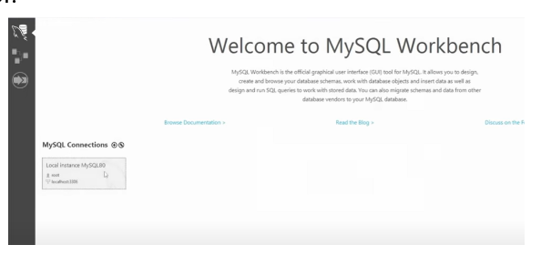

La conexión que nos aparece por defecto es la de nuestro servidor local que es con la que trabajaremos por defecto aunque podremos añadir conexiones a bases de datos externas más adelante.

Clicamos dos veces en la conexión y nos pedirá la clave del famoso usuario root (Admin), la introducimos y ya estaremos conectados.

Nos aparecerá una ventana como esta:

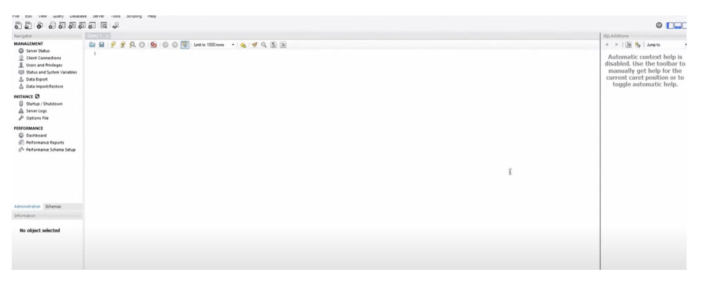

Es la pestaña de Administración, cambiamos a la que pone “Schemas”:

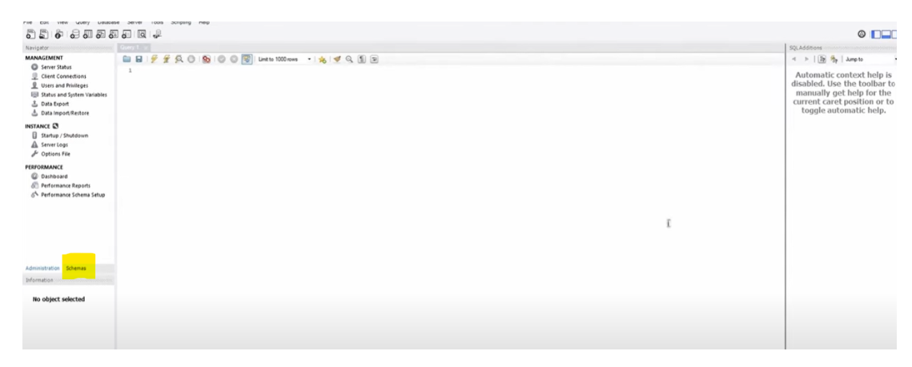

Schemas (esquemas) contiene lo que son realmente las bases de datos a las que tenemos acceso dentro de esa conexión. Como hemos instalado un par de ellas de ejemplo, deberíamos ver 3 bases de datos: sakila, world y sys. Sys no nos interesa, pero las otras 2 bases si, ya que son con las empezaremos a hacer nuestras primeras consultas (queries). Si desplegamos Sakila podemos ver la estructura de tablas que hay dentro de ella:
 
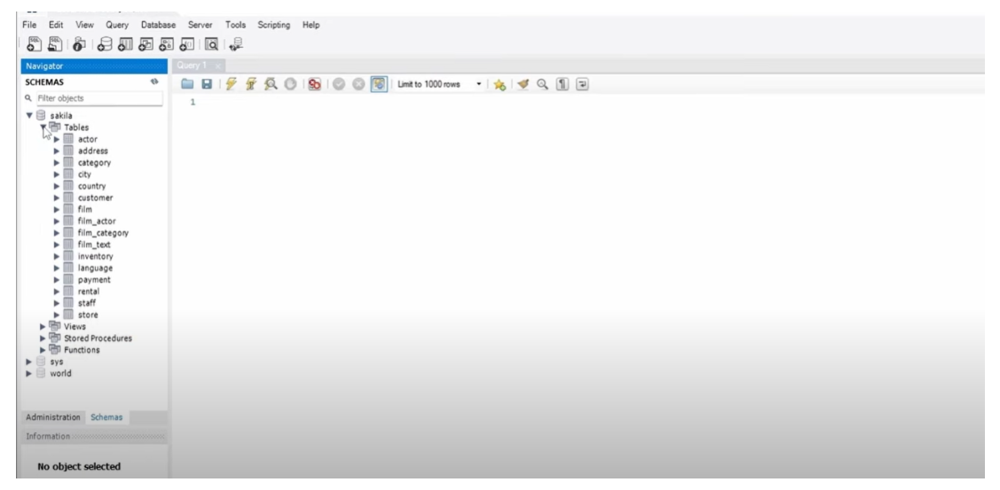

¡Enhorabuena! 💪 si has llegado hasta aquí, ya tienes todo preparado para empezar a tirar queries como si las fueran a prohibir.

